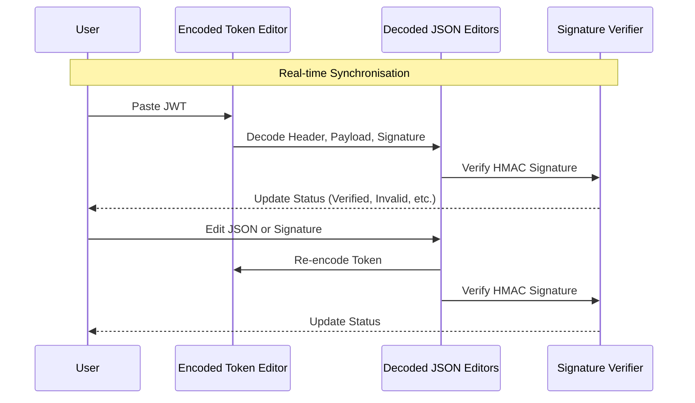

# Tokun — JWT Debugger

Tokun is a lightweight, interactive, and responsive JSON Web Token (JWT)
debugger built with vanilla HTML, CSS, and JavaScript.

[](https://tokun.yogu.one)
[](LICENSE)

## Purpose

The goal of Tokun is to provide a fast, privacy-focused, and framework-free tool
for JWT manipulation. It allows developers to quickly inspect and edit JWTs
without relying on external services. All data is processed locally in the
browser, ensuring sensitive tokens never leave your machine.

## Key Features

- **Real-time Sync**: Paste an encoded JWT to decode it, or edit the decoded
  JSON (Header, Payload, or Signature) to re-encode the token instantly.
- **Signature Verification**: Supports HS256, HS384, and HS512 algorithms using
  the native Web Crypto API.
- **JSON Validation**: Real-time syntax checking for Header and Payload editors
  with visual feedback.
- **Privacy-Focused**: Client-side execution ensures your JWTs are never
  transmitted over the network.
- **Dark/Light Mode**: Respects system preferences and allows manual toggling
  with persistent state.
- **Vanilla Tech Stack**: Zero dependencies, no frameworks, and no build step
  for maximum performance.
- **Mobile-First Design**: Fully responsive layout optimised for all device
  sizes.
- **Accessibility (A11y)**: Built with semantic HTML, ARIA attributes, and full
  keyboard navigation (WCAG AA).
- **Copy to Clipboard**: One-click copying for encoded tokens and individual
  JSON components.

## How it Works



## Technology Stack

Tokun is built with simplicity and performance in mind:

- **HTML5**: Semantic markup and ARIA attributes for accessibility.
- **CSS3**: Modern layout (Grid, Flexbox) and Custom Properties for theming.
- **Vanilla JavaScript (ES6+)**: Pure DOM manipulation and JWT logic.
- **Web Crypto API**: Native browser support for cryptographic operations.
- **Deno**: Used for local development tools (server, formatting, and linting).
- **Makefile**: Task runner for common operations.

## Project Structure

```text
tokun/
├── web/                   # Website source files
│   ├── index.html         # Main entry point (UI structure)
│   ├── css/
│   │   ├── variables.css  # Global CSS variables (colours, spacing)
│   │   └── styles.css     # Main layout and component styling
│   ├── js/
│   │   ├── jwt.js         # Core JWT encoding/decoding logic
│   │   ├── theme.js       # Dark/Light mode logic (localStorage persisted)
│   │   └── utils.js       # Reusable helpers (base64url, toast, clipboard)
│   └── assets/
│       └── tokun.png      # Visual assets (logo, favicon)
├── AGENTS.md              # Project guidelines for AI agents
├── LICENSE                # Licence information
├── Makefile               # Task automation
├── README.md              # Documentation for developers
└── serve.ts               # Deno development server
```

## Requirements to Run

### For Users

Simply open `web/index.html` in any modern web browser that supports ES6 modules
and the Web Crypto API.

### For Developers

To use the development tools, you will need:

- [Deno](https://deno.land/)
- `make` (optional)

## Local Development

1. **Start the local server**:
   ```bash
   make serve
   ```
2. **Format source files**:
   ```bash
   make fmt
   ```
3. **Lint source files**:
   ```bash
   make lint
   ```

The server will be available at `http://localhost:8000`.

## Licence

This project is licensed under the **GNU General Public License v3 (GPL-3.0)**.
See the [LICENSE](LICENSE) file for details.

## Contributing

Please refer to the [AGENTS.md](AGENTS.md) file for development standards and
guidelines.
